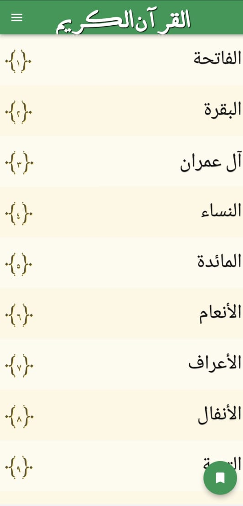
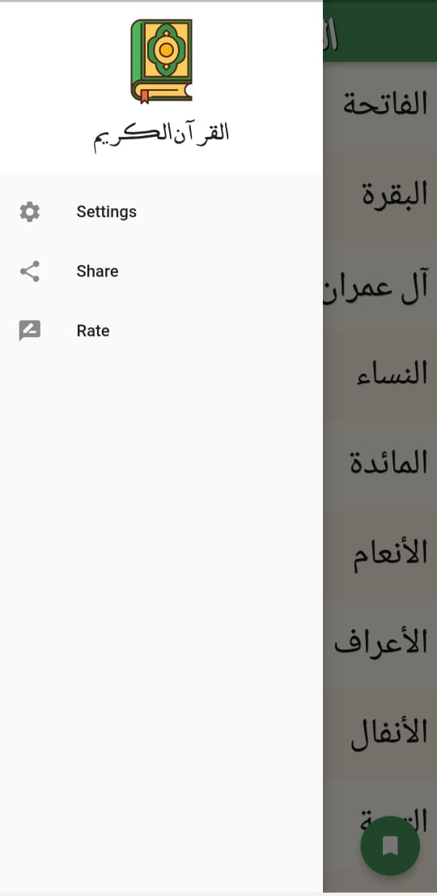
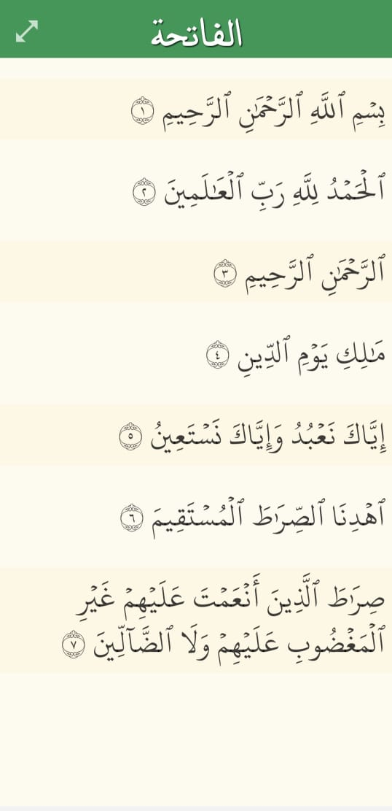
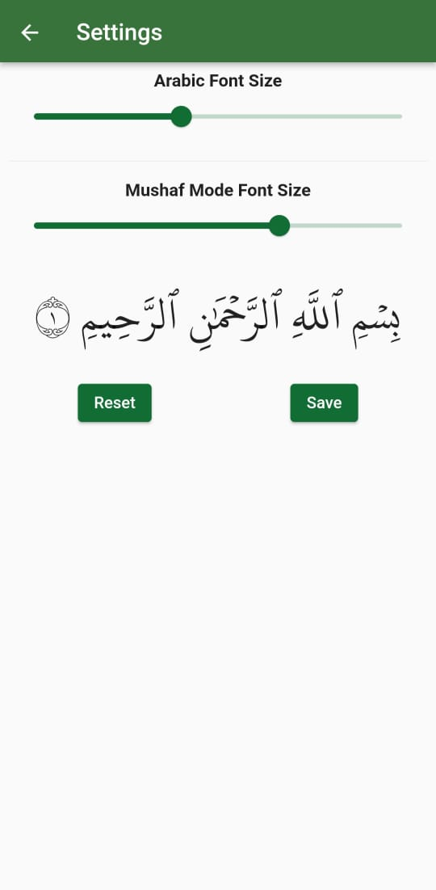

# Quran Kareem App (Offline)

This is a mobile application for reading the Holy Quran offline.

**Features:**

* Access the full Quran text without an internet connection.
* Navigate through Surah (chapters) and verses easily.

**Screenshots:**

*  Splash Screen (Alt text: App launch screen) 
*  Index Screen (Alt text: App home screen) 
*  Navigation Drawer (Alt text: Menu for accessing app features) 
*  Surah List Screen (Alt text: List of Quran chapters) 
*  Full Surah View (Alt text: View of a single Quran chapter) 
*  (Add alt text for remaining screenshots) 
*  Quran Settings (Alt text: Settings screen for the Quran app) 

**Packages Used:**

* Shared Preferences
* Arabic Numbers
* Scrollable Positioned List
* Share Plus
* Url Launcher
* Go Router
* Audio Players (Specify which audio player if applicable)

**Feel free to contribute to this project!**

